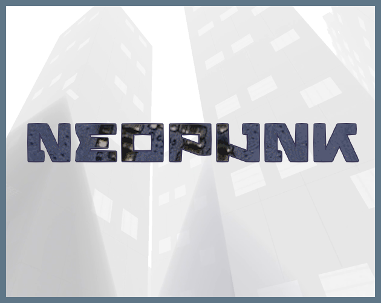
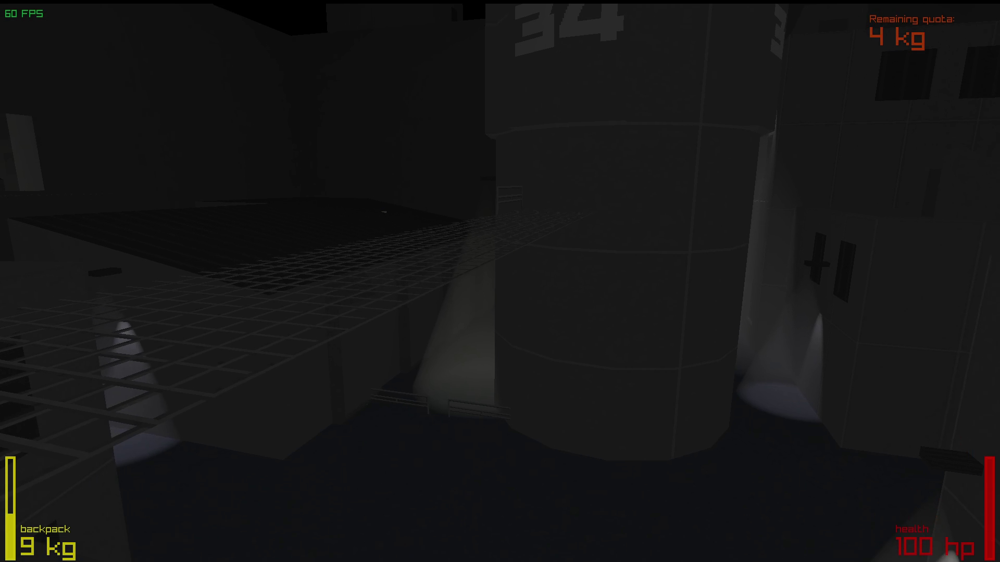
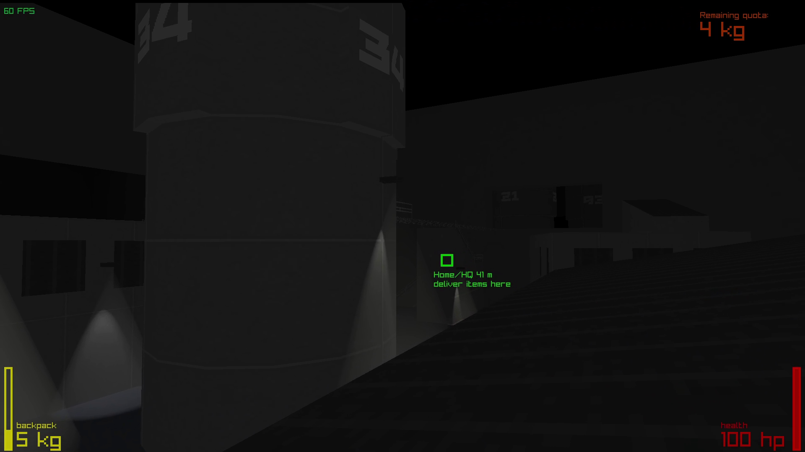
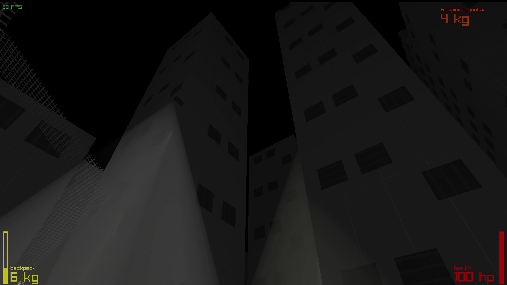

## Neopunk



### Description
You are a scrap collector, living in dark industrial city. Collect the metal exploring the city and bring it back to complete the quota.

### Links
 - [YouTube Gameplay](https://youtu.be/sJ919sPMM6k)
 - [itch.io Release](https://venediktvad.itch.io/neopunk)
 - [LD58 Submisson](https://ldjam.com/events/ludum-dare/58/neopunk)

### Controls
- **E** - Interaction
- **WASD** - Movement
- **SPACE** - Jump
- **ALT+ENTER** - Switch fullscreen
- **ESC** - Quit

### Screenshots




## Getting Started

#### Linux
When setting up this template on linux for the first time, install the dependencies from this page:
([Working on GNU Linux](https://github.com/raysan5/raylib/wiki/Working-on-GNU-Linux))

You can use this templates in a few ways: using Visual Studio, using CMake, or make your own build setup. This repository comes with Visual Studio and CMake already set up.

Chose one of the follow setup options that fit in you development environment.

### Visual Studio

- After extracting the zip, the parent folder `raylib-game-template` should exist in the same directory as `raylib` itself.  So, your file structure should look like this:
    - Some parent directory
        - `raylib`
            - the contents of https://github.com/raysan5/raylib
        - `raylib-game-template`
            - this `README.md` and all other raylib-game-template files
- If using Visual Studio, open projects/VS2022/raylib-game-template.sln
- Select on `raylib_game` in the solution explorer, then in the toolbar at the top, click `Project` > `Set as Startup Project`
- Now you're all set up!  Click `Local Windows Debugger` with the green play arrow and the project will run.

### CMake

- Extract the zip of this project
- Type the follow command:

```sh
cmake -S . -B build
```

> if you want to configure your project to build with debug symbols, use the flag `-DCMAKE_BUILD_TYPE=Debug`

- After CMake configures your project, build with:

```sh
cmake --build build
```

- Inside the build folder is another folder (named the same as the project name on CMakeLists.txt) with the executable and resources folder.
- In order for resources to load properly, cd to `src` and run the executable (`../build/${PROJECT_NAME}/${PROJECT_NAME}`) from there.

- cmake will automatically download a current release of raylib but if you want to use your local version you can pass `-DFETCHCONTENT_SOURCE_DIR_RAYLIB=<dir_with_raylib>` 

## License

This game sources are licensed under an unmodified zlib/libpng license, which is an OSI-certified, BSD-like license that allows static linking with closed source software. Check [LICENSE](LICENSE) for further details.

$(Additional Licenses)

*Copyright (c) $(Year) $(User Name) ($(User Twitter/GitHub Name))*
